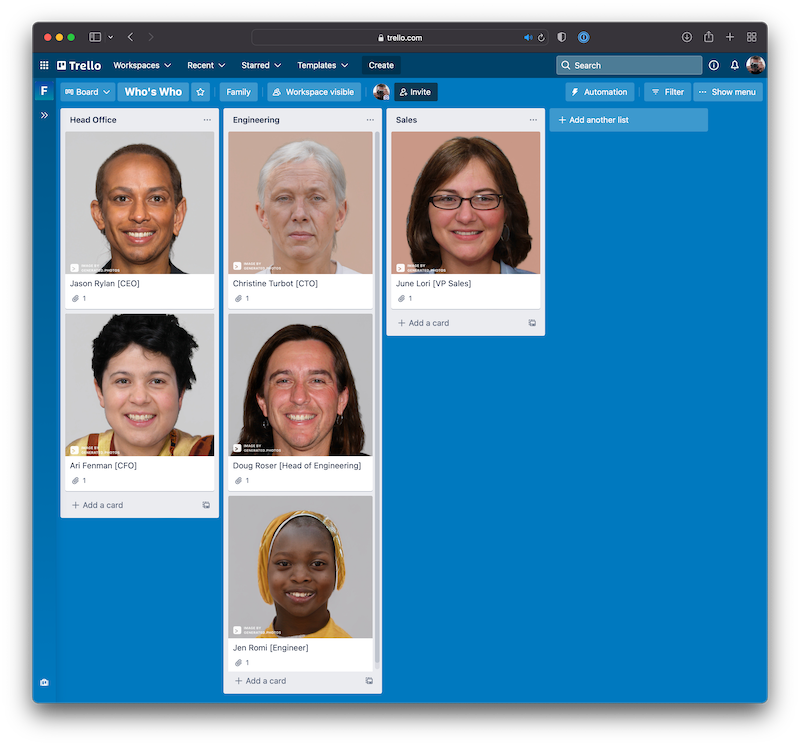

[](https://sonarcloud.io/summary/new_code?id=fac_whodat)
[](https://sonarcloud.io/summary/new_code?id=fac_whodat)
[](https://sonarcloud.io/summary/new_code?id=fac_whodat)

# Who 'Dat?


Who 'Dat? is simple game to help you get to know the people on your team.

It parses the data in a "Who's Who" Trello board which must be constructed as follows:

* A list for each team. The title of the list is the team name
* A card for each person, with their headshot as a cover image. The title of the card should be in the form "Full Name [Role Title]"



## Setting up your dev environment

Who 'Dat? is a straightforward Rails app.

### Set up the Rails app

Check out the repo then install the required gems:

```bash
gem install bundler
bundle install
```

Next, set up the database:

```bash
bundle exec rails db:create
bundle exec rails db:reset
```

### Configure Trello

You need to configure the app with Trello credentials.

First [obtain your API keys](https://trello.com/app-key) from your Trello account.

Next, add the keys to your Rails credentials (using `bin/rails credentials:edit`):

```yaml
trello:
  api_key: [YOUR API KEY]
  token: [YOUR API TOKEN]
```

You also need to set the environment variable `TRELLO_BOARD_ID` (e.g. `Yae2dtTq`).

### Configure Google Sign In

You need to configure the app with Google creds.

Follow the instructions in the [Basecamp Ruby gem README](https://github.com/basecamp/google_sign_in) to get your app keys, then add them to your Rails credentials:

```yaml
google_sign_in:
  client_id: [YOUR CLIENT ID]
  client_secret: [YOUR CLIENT SECRET]
```

### Import the data from Trello into the database

You will need to run this regularly to keep the database in sync with Trello.

```bash
bundle exec rake trello:load_people
```

## Running the app

To run the app:

```bash
bundle exec rails server
```

You can view the app at http://localhost:3000. You'll need to log in via Google to play.

## Deploying to Heroku

If you're deploying to Heroku you'll need to configure `Active::Storage` to store the attachments in cloud storage. By default this is in DigitalOcean spaces (it's way easier to wrangle than S3).

In `storage.yml` you can see the Digital Ocean storage options:

```yaml
digitalocean:
  service: S3
  access_key_id: <%= Rails.application.credentials.dig(:digitalocean, :access_key_id) %>
  secret_access_key: <%= Rails.application.credentials.dig(:digitalocean, :secret_access_key) %>
  bucket: <%= Rails.application.credentials.dig(:digitalocean, :bucket) %>
  region: <%= Rails.application.credentials.dig(:digitalocean, :region) %>
  endpoint: <%= Rails.application.credentials.dig(:digitalocean, :endpoint) %>
```

This is referenced in `production.rb`:

```ruby
config.active_storage.service = :digitalocean
```

Details of the Digital Ocean Spaces bucket and API keys are defined in your Rails credentials:

```yaml
digitalocean:
  access_key_id: [YOUR ACCESS KEY]
  secret_access_key: [YOUR SECRET KEY]
  bucket: [YOUR BUCKET NAME]
  region: [YOUR REGION e.g. ams3]
  endpoint: [YOUR ENDPOINT e.g. https://ams3.digitaloceanspaces.com]
```
